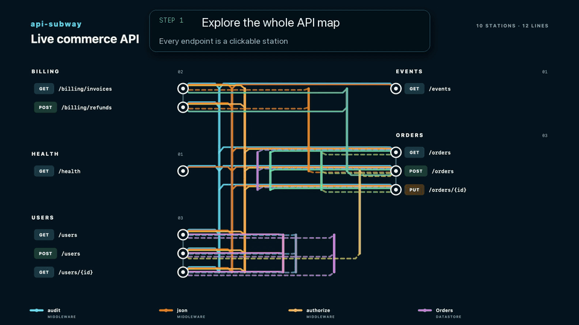

# api-subway

[](https://github.com/artemKuch/api-subway/actions/workflows/ci.yml)
[](https://github.com/artemKuch/api-subway/releases)
[](https://www.rust-lang.org/)
[](LICENSE)

[](https://www.npmjs.com/package/api-subway)
[](https://pypi.org/project/api-subway/)
[](https://crates.io/crates/api-subway)

**Fast, local API maps and contract debugging — built in Rust.**

**[Try the live interactive demo →](https://artemkuch.github.io/api-subway/)**

`api-subway` turns a codebase into a subway map: every `HTTP method + path` is a station, while middleware, services, data clients, and external integrations become lines. One command produces a README-safe SVG, a standalone interactive HTML explorer, and an optional deterministic JSON model.

It analyzes source code without starting the application, installing its dependencies, uploading code, or making network requests.

[](https://artemkuch.github.io/api-subway/)

The HTML map is more than a diagram. Open several endpoint windows, edit schema-backed requests, run them against one browser-local JSON backend, and watch related responses update immediately. In the demo above, `PUT /orders/{id}` changes an order and the open `GET /orders` window reflects the same `total: 149.9` value. [Watch the original MP4](docs/videos/api-subway-api-debugging.mp4).

## Why api-subway

- **Understand an unfamiliar API quickly.** Routes become readable districts; shared dependencies become visible lines.
- **Debug contracts locally.** Request and response views switch between typed schema fields and JSON.
- **Explore state across endpoints.** `POST`, `PUT`, `PATCH`, and `DELETE` update one shared virtual backend used by every open window.
- **Know what is proven.** Solid lines are exact relations; dashed lines are bounded inferences; unresolved dynamic behavior becomes a diagnostic.
- **Keep docs reproducible.** Stable ordering and timestamp-free output make generated artifacts suitable for README files and CI.

## Fast by default

The analyzer is a native Rust CLI built on Oxc for JavaScript/TypeScript and Tree-sitter for Python. On the recorded Apple Silicon baseline, a route-dense synthetic project analyzed in:

| Source | Median |
| ---: | ---: |
| 1,000 files / ~100k LOC | 94.7 ms |
| 10,000 files / ~1M LOC | 639.4 ms |

These are local measurements, not universal latency guarantees. The fixture, environment, and reproduction commands are documented in [BENCHMARKS.md](BENCHMARKS.md).

## Quick start

Run the native CLI directly through npm or PyPI:

```bash
npx api-subway generate . --out docs/api-subway

# or
uvx api-subway generate . --out docs/api-subway
```

Install it permanently with Rust 1.95+:

```bash
cargo install --locked api-subway
api-subway generate . --out docs/api-subway
```

Prebuilt native archives for macOS, glibc-based Linux, and Windows are also available from the [latest GitHub Release](https://github.com/artemKuch/api-subway/releases/latest). npm and PyPI install the same platform-specific Rust binaries; the Cargo package builds the CLI from its published source.

By default the command detects supported frameworks and writes:

| Artifact | Purpose |
| --- | --- |
| `api-subway.svg` | Static GitHub-safe map for a README |
| `api-subway.html` | Standalone explorer and local contract sandbox |
| `api-subway.json` | Stable `ApiMapV1` model when `--format json` is requested |

Commit the SVG and HTML, then use `check` in CI:

```bash
api-subway check . --out docs/api-subway
```

`check` writes nothing. It returns `1` when committed artifacts are stale and `2` for fatal errors or strict diagnostics.

## Local API debugging

Click a station in `api-subway.html` to open a movable endpoint window.

1. Fill path, query, header, cookie, or body fields from the extracted contract.
2. Switch the request between **Schema** and **JSON** without losing edits.
3. Run the endpoint against the shared in-memory store.
4. Inspect the response as typed fields or JSON.
5. Keep related windows open to see mutations propagate in real time.

**Open backend** exposes the complete virtual store as editable JSON. Applying changes replaces the current store atomically and resets open endpoint windows. Import, export, record-count, nesting-depth, and file-size limits keep the sandbox bounded.

The sandbox models contract-safe CRUD behavior; it is not an emulator for application code. It never executes target handlers, middleware, authorization, database queries, transforms, or third-party calls. Ambiguous action routes are explicitly marked `inferred`.

## Supported inputs

| Input | v0.1 coverage |
| --- | --- |
| Next.js App Router | Route handlers, route groups, dynamic/catch-all segments, `proxy.ts`, and legacy `middleware.ts` matchers |
| Express 4/5 | Direct routes, `route()` chains, handler arrays, ordered `use()`, nested mounts, and common static Zod contracts |
| FastAPI | `FastAPI`, `APIRouter`, decorators, prefixes, middleware, `Depends`, `Annotated`, sub-dependencies, and common Pydantic models |
| OpenAPI 3.0/3.1 | Local JSON/YAML operations, parameters, bodies, responses, schemas, tags, security, and local `$ref` |

Next Pages API, NestJS, Fastify, Hono, Django, Flask, Spring, ASP.NET, runtime tracing, and cloud analysis are outside v0.1.

## What the lines mean

Relations come from framework declarations, reachable AST calls, local call/import traces, OpenAPI security, or explicit configuration rules.

- `exact` — a declaration or known-client call was proven; rendered solid.
- `inferred` — a reachable local boundary or configured rule matched; rendered dashed.
- unresolved — a dynamic path, mount, matcher, or call could not be resolved safely; reported as a diagnostic instead of guessed.

The JSON model keeps repository-relative `file:line:column` evidence. Generated artifacts omit source snippets, payload examples from source, absolute paths, and timestamps. See [docs/ACCURACY.md](docs/ACCURACY.md) for the acceptance corpus and known blind spots.

## CLI

```text
api-subway generate [ROOT] [OPTIONS]
api-subway check [ROOT] [OPTIONS]
```

| Option | Meaning |
| --- | --- |
| `--framework auto\|next\|express\|fastapi` | Select one or more analyzers |
| `--format svg\|html\|json` | Select one or more output formats |
| `--openapi FILE` | Merge a local OpenAPI document; repeatable |
| `--config FILE` | Use a TOML configuration file |
| `--theme auto\|paper\|midnight` | Select the artifact theme |
| `--strict` | Fail on warning or error diagnostics |

Configuration defaults to `ROOT/.api-subway.toml`. The complete versioned example is [`.api-subway.example.toml`](.api-subway.example.toml).

## Static map

The committed map below is generated from [`fixtures/demo`](fixtures/demo), not hand-authored data.



## Project documentation

| Document | Audience |
| --- | --- |
| [docs/ACCURACY.md](docs/ACCURACY.md) | Supported static forms, evidence semantics, and blind spots |
| [SECURITY.md](SECURITY.md) | Trust boundaries, resource limits, and vulnerability reporting |
| [BENCHMARKS.md](BENCHMARKS.md) | Recorded performance baseline and reproduction |
| [CONTRIBUTING.md](CONTRIBUTING.md) | Architecture, analyzer rules, and required checks |
| [RELEASE.md](RELEASE.md) | Maintainer release and artifact-verification runbook |
| [CHANGELOG.md](CHANGELOG.md) | User-visible changes by version |

## Build from source

```bash
cargo build --release --locked -p api-subway
./target/release/api-subway generate fixtures/demo --out /tmp/api-subway
```

The workspace separates the stable model, analyzers, renderer, and CLI into owned crates. Contributor setup and the full verification matrix live in [CONTRIBUTING.md](CONTRIBUTING.md).

## License

MIT. See [LICENSE](LICENSE).
